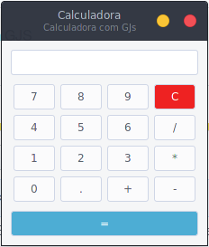

# GJS = JavaScript + GTK

Para poder utilizar Javascript + Gtk você precisa ter instalado o gjs que vem por padrão na instalação no Gnome ou o cjs que vem com o Cinnamon que é um fork do Gnome.

Depois de ter instalado o gjs para rodar qualquer um dos arquivos basta utilizar os métodos abaixo:

  Método 1:

    // Navegue até a pasta dos aquivos
    cd ~/arquivos/

    // Utilize o gjs ou cjs
    gjs arquivo.js

  Método 2:

    // Adicone permissão de execução no arquivo
    chmod +x arquivo.js

    // Executar o arquivo
    ./arquivo.js

    // Caso nescessário verique a primeira linha do arquivo para ecolher o binario que irá executar o arquivo, se instalou o cjs basta trocar
    #!/usr/bin/gjs por #!/usr/bin/cjs ou vice-versa

### gjcalculator.js
  License [GPLv3](https://www.gnu.org/licenses/gpl.html)

  GJcalculator é uma simples calculadora desenvolvida com gjs + gtk pra fins de estudo.

      //Para adiconar no sistema basta criar um link simbólico para /bin
      #: ln -s /diretorio/do/arquivo/gjcalculator /usr/bin/gjcalculator

      //Depois mova o lançador desktop para ~/.local/share/applications
      $: cd /diretorio/do/arquivo/
      $: mv gjcalculator ~/.local/share/applications/

      //Com isso o gjcalculator estará disponivel no seu menu do sistema, basta procurar por calculadora

  

### testeWebkit.js
  É um exemplo de como utilizar o webkit para criar web apps ou para coisas mais avançadas
